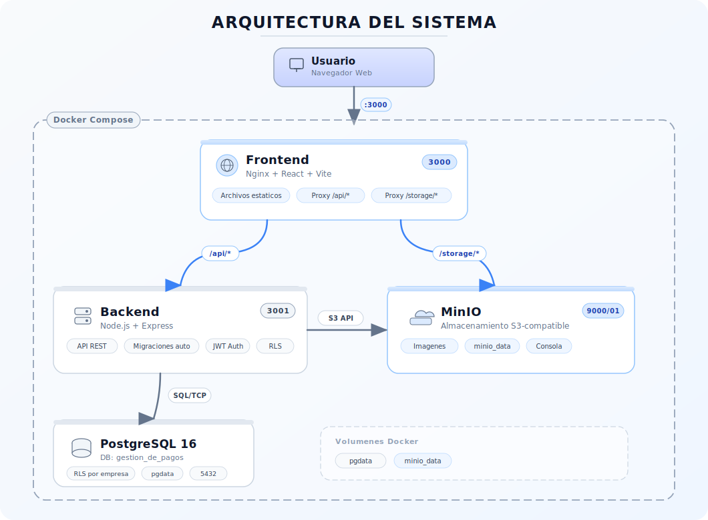

# GestionDePagosApp

Sistema de gestion integral para empresas — compras, ventas, proveedores, clientes, materiales, stock y presupuestos con generacion de PDF.

## Que es?

GestionDePagosApp es una aplicacion web pensada para negocios que necesitan llevar el control de sus operaciones diarias: registrar compras y ventas, gestionar proveedores y clientes, controlar el stock de materiales, y generar presupuestos en PDF.

El sistema soporta **multi-empresa**: cada empresa accede unicamente a sus propios datos, aislados a nivel de base de datos mediante Row-Level Security (RLS).

## Tecnologias

| Capa                | Tecnologias                                           |
| ------------------- | ----------------------------------------------------- |
| **Frontend**        | React 18, TypeScript, Vite, Tailwind CSS, Material UI |
| **Backend**         | Node.js 20, Express, PostgreSQL 16                    |
| **Almacenamiento**  | MinIO (compatible con S3) para imagenes               |
| **Infraestructura** | Docker, Docker Compose, Nginx                         |

## Arquitectura



## Requisitos

- [Docker](https://docs.docker.com/get-docker/) y Docker Compose instalados
- Git

## Como levantar el proyecto

### 1. Clonar el repositorio

```bash
git clone https://github.com/juaniandrada23/GestionDePagosApp.git
cd GestionDePagosApp
```

### 2. Configurar variables de entorno (solo para produccion)

Para **desarrollo local**, no hace falta configurar nada — `docker-compose.yml` ya incluye valores por defecto.

Para **produccion**, copiar el archivo de ejemplo y completar las variables:

```bash
cp .env.example .env
```

Variables obligatorias en `.env`:

| Variable           | Descripcion                                         |
| ------------------ | --------------------------------------------------- |
| `JWT_SECRET`       | Clave secreta para firmar tokens JWT                |
| `DB_PASSWORD`      | Contrasena del usuario principal de PostgreSQL      |
| `DB_APP_PASSWORD`  | Contrasena del usuario de aplicacion (RLS)          |
| `MINIO_ACCESS_KEY` | Credencial de acceso a MinIO                        |
| `MINIO_SECRET_KEY` | Credencial secreta de MinIO                         |
| `CORS_ORIGIN`      | Dominio del frontend (ej: `https://tu-dominio.com`) |

### 3. Levantar los servicios

```bash
docker-compose up
```

Esto levanta automaticamente:

- PostgreSQL con la base de datos `gestion_de_pagos`
- MinIO para almacenamiento de imagenes
- Backend con migraciones automaticas al iniciar
- Frontend con Vite en modo desarrollo

### 4. Abrir la aplicacion

Ir a [http://localhost:3000](http://localhost:3000), registrar un usuario y empezar a usar.

## Estructura del proyecto

```
GestionDePagosApp/
├── backend/
│   ├── config/          # Configuracion centralizada
│   ├── db/              # Pool de conexiones y migraciones SQL
│   ├── errors/          # Clases de error tipadas
│   ├── middleware/       # Auth, validacion, tenant context, error handler
│   ├── repositories/    # Capa de acceso a datos
│   ├── Routes/          # Endpoints HTTP
│   ├── services/        # Logica de negocio
│   └── validation/      # Esquemas de validacion
├── frontend/
│   └── src/
│       ├── components/  # Componentes reutilizables
│       ├── pages/       # Paginas de la aplicacion
│       ├── services/    # Cliente API (axios)
│       ├── context/     # Contextos de React (auth, tema)
│       ├── hooks/       # Hooks personalizados
│       ├── types/       # Tipos TypeScript
│       └── router/      # Rutas y proteccion de rutas
├── docker-compose.yml       # Desarrollo local
├── docker-compose.prod.yml  # Produccion
└── .env.example             # Variables de entorno de ejemplo
```

## Produccion

El archivo `docker-compose.prod.yml` esta preparado para despliegue con:

- Builds optimizados (Dockerfiles propios para backend y frontend)
- Redes aisladas (los servicios internos no exponen puertos al host)
- Limites de memoria por servicio
- Rotacion de logs automatica
- Variables de entorno obligatorias validadas al iniciar
